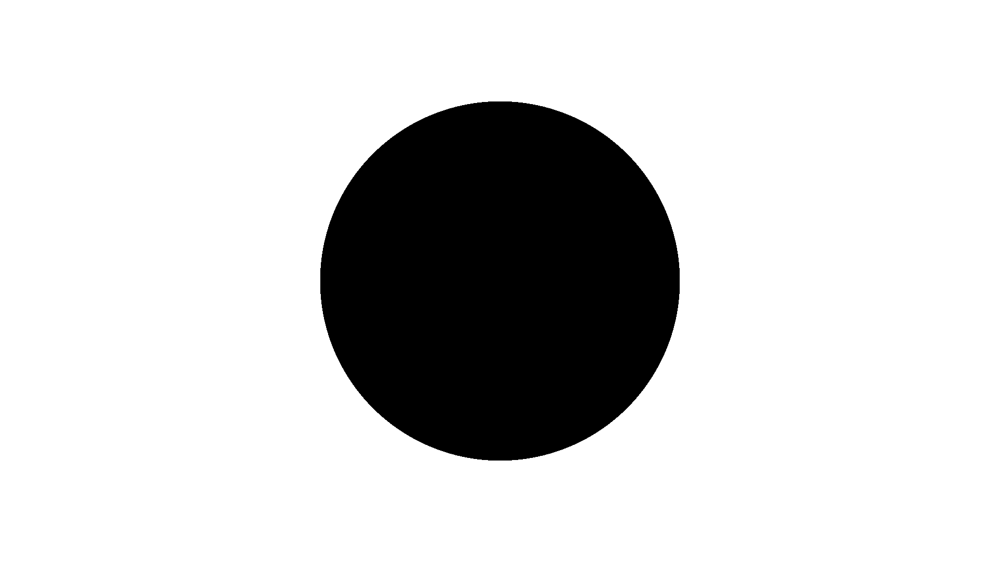

Arlunio (formerly "stylo" which was fromerly "mathemage") is a Python library
that can be used to draw images. At the time of writing to draw a circle and
save it as a PNG image (like the one you can see above) all we need is the
following code.


```python
import arlunio as ar

circle = ar.S.Circle()
image = circle(1920, 1080)
image.save("circle.png")
```

But what is really going on here? In this post we're going to take a peek
behind the curtain and find out how `arlunio` goes from code to pixels.

## The Idea

One of core ideas behind arlunio is set theory, where more complex shapes are
built up through the combinatuion of simpler ones using the basic [set
operations](https://en.wikipedia.org/wiki/Set_(mathematics)#Basic_operations)
We won't cover the construction of complex shapes in this post, instead we will
focus on the construction of a single basic shape - the circle.

You may already be familiar with the concept of a set since many of the popular
programming languages include a set data structure. However so that we are all
on the same page let's briefly run through some of the details we need for the
purposes of this post.

A set is is a collection of items, however unlike a list there is no order to a
set and every item is unique.

```python
Python 3.7.4 (default, Jul 16 2019, 07:12:58)
[GCC 9.1.0] on linux
Type "help", "copyright", "credits" or "license" for more information.

>>> number_list = [1, 1, 3, 2, 5, 3]
>>> number_set = set(number_list)
>>> number_set
{1, 2, 3, 5}
```

Notice how all the duplicates have been discarded when we created our set? You
might also remember that I said a set was unordered, but Python has clearly
sorted these numbers so what do we mean when we say a set is unordered?

Perhaps it would be more clear if we made a set that didn't contain just
numbers

```python
>>> random_set = { 3, False, "Hi there", (1, 23, 4)}
>>> random_set
{False, 'Hi there', 3, (1, 23, 4)}
```

Python has presented this set to us in a different order to the one we
constructed it in but is it any "better" or "more ordered" than the one we
used? There is no "first" item in this collection and Python will tell us as
much if we try and ask for it.

```python
>>> random_set[0]
Traceback (most recent call last):
  ...
TypeError: 'set' object is not subscriptable
```

## The Implementation

In this section we're going to take the ideas we introduced in the previous
section and implement them... backwards! :) I think it makes more sense to
start with what we need in order to produce an image file on disk and work
backwards.

> ### Note
>
> At least the time of writing this post the way that `arlunio` produces images
> today is virtually identical to this process - just with a number of
> abstractions that aim to make various stages in this process easier to work
> with

Much of the heaving lifting for us will be handled by the
[NumPy](https://www.numpy.org/) and [Pillow](https://python-pillow.org/)
libraries.

```python
import numpy as np
import PIL.Image
```

We can then save this image

```python
height, width, _ = pixels.shape
image = PIL.Image.frombuffer("RGB", (width, height), pixels, "raw", "RGB", 0, 1)

with open("circle.png", "wb") as f:
    image.save(f)
```
