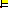

Arlunio (formerly "stylo" which was formerly "mathemage") is a Python library
that can be used to draw images. At the time of writing to draw a circle and
save it as a PNG image (like the one you can see above) all we need is the
following code.


```python
import arlunio as ar

circle = ar.S.Circle()
image = circle(1920, 1080)
image.save("circle.png")
```

But what is really going on here?

As with most drawing related programs `arlunio` has the concept of a
shape. Shapes in `arlunio` can be thought of as a mathematical set and in fact
borrow some ideas from [set theory][set-theory]. For the purpose of this article
the idea we are most interested in is that of inclusion. Given a set of objects
$S$ we can ask if a particular object $s$ is included in that set.

Taking what is a fairly simple idea and running with it `arlunio`'s core drawing
algorithm boils down to the following statement.

> Given a rule that describes a shape, construct the set of pixels satisfying
> the rule and colour them in.

We will spend much of the remainder of this article going into detail on how
exactly we "construct the set of pixels satisfying the rule" and learn how we
can draw the image above - the hard way.

## Image Data in Python

Before diving into detail on the inner workings of `arlunio` it's probably worth
taking a quick detour to look at how we can represent image data in Python so
that when it comes to writing the code to draw the circle we have an idea on
what we are aiming for.

There are many ways to represent image data, some will be more or less useful
depending on your use case. The representation that seems to have worked well
for `arlunio` so far has been to use a [NumPy](https://www.numpy.org/) array.

You can think of NumPy arrays as lists but with a *lot* more functionality! If
we wanted to represent a black and white image in Python we could use a 2D NumPy
array of numbers where a `1` represents a white pixel and a `0` represents a
black pixel. Then a `2x2` pixel checker board could be represented by the
following

```python
>>> import numpy as np

>>> pixels = np.array([[0, 1], [1, 0]])
>>> pixels
array([[0, 1],
       [1, 0]])
```

We can check to see which colour a particular pixel is by giving it's index to
the array.

```python
>>> pixels[0, 0]
0

>>> pixels[0, 1]
1
```

We can also check the dimensions of the image by looking at the `shape`
attribute

```python
>>> pixels.shape
(2, 2)
```

### Adding Colour

However we will typically want to use more colours than just black and white so
we need a better representation of the colour value for each pixel. If you do
any reading on the subject you will quickly discover that colour is **hard** and
there are *many* different formats and representations of it. This means that
there is no right answer here, just better or worse ones depending on the
situation.

For now we will use a representation that is sometimes referred to as ["True
Color"][true-color] where instead of storing a single number at each pixel we
store an array of 3 numbers. Each number can be between 0 and 255 and will
represent the intensity of Red, Green and Blue in that pixel which combines to
form the colour you see in the final image.

Using this representation for colour, a `2x2` pixel checker board would look
like the following.

```python
>>> black = (0, 0, 0)
>>> white = (255, 255, 255)
>>> pixels = np.array([[white, black], [black, white]], dtype=np.uint8)
>>> pixels
array([[[255, 255, 255],
        [  0,   0,   0]],

       [[  0,   0,   0],
        [255, 255, 255]]], dtype=uint8)
```

Notice that we're telling NumPy that the value of each colour value is capped at
`255` by setting the data type to be `np.uint8` when creating the array. This
becomes important when it comes to saving our image to disk. For more
information on data types check out NumPy's [documentation][numpy-data] on the
subject. Also notice that when we check the dimensions of our image we now are
dealing with a 3D NumPy array

```python
>>> pixels.shape
(2, 2, 3)
```

Where the first two numbers are the `height` and the `width` of the image (in
that order!) and the final number represents the number of [colour
channels][color-channels] in the image.

### Creating a PNG

Currently we're able to represent the raw data that makes up an image using our
NumPy arrays, however we want to be able to see it! One such method would be to
save it as a PNG image file, that way we can do what we like with our image
afterwards.

To do this we will make use of the [Pillow][pillow] library which can take our
raw image data and save it to file for us. In particular we can use the
[frombuffer()][frombuffer] method to create an instance of Pillow's `Image`
object from our NumPy array. If I'm honest I don't understand every argument we
give to this function but following the example in the documentation it seems to
work well enough.

```python
>>> import PIL.Image

>>> height, width, _ = pixels.shape
>>> image = PIL.Image.frombuffer("RGB", (width, height), pixels, "raw", "RGB", 0, 1)
```

Then with the image created it's easy enough to save it to disk.

```python
>>> with open("checkers.png", "wb") as f:
...     image.save(f)
```

### Worked Example

To help better illustrate how images are constructed and saved in this way we
will work through creating our own artwork in a style inspired by some of the
work of [Piet Mondrian][piet-mondrian] such as his piece titled [Tableau
I][tableau]. I encourage you to try this out yourself and experiment around with
the code!



We start off by creating a blank `8x8` image using the [np.full()][numpy-full]
function that can initialise an array of the given size with our desired
background colour

```python
import numpy as np
import PIL.Image

width = 8
height = 8
white = (255, 255, 255)

pixels = np.full((height, width, 3), white, dtype=np.uint8)
```


1. Write down a rule that describes the shape you wish to draw.
1. Decide on a domain $D$, this will be the "arena"
1. Decide on the desired resolution of the final image - say `1920x1080` pixels.
2. For every pixel in the image assign it a coordinate in the $xy$-plane
3. For every coordinate value that represents a pixel decide if it is *included*
   within the boundary of the shape.
4. For every pixel that it within the boundary of the shape, color it in.

The remainder of this blog post is dedicated to explaining the steps in this
process with more detail. It is split into two parts with a section on **the
theory** where we dive deeper into the representation of shapes in `arlunio` and
how they relate to some of the ideas in [set theory][set-theory].

Or if you would rather jump straight to the code we then have a section on **the
implementation** where we take the ideas developed in the theory section and
convert them into Python code.

## The Theory

A set is is a collection of items, however they are different from other
"collection" data types like lists since there is no order to a set and there is
only ever one instance of a given item.

```python
Python 3.7.4 (default, Jul 16 2019, 07:12:58)
[GCC 9.1.0] on linux
Type "help", "copyright", "credits" or "license" for more information.

>>> number_list = [1, 1, 3, 2, 5, 3]
>>> number_set = set(number_list)
>>> number_set
{1, 2, 3, 5}
```

When we say there is no order to a list we are not saying that the elements to a
set are not sorted - we can clearly see Python has presented this set to us with
the items in ascending order. Instead we mean that there is no such thing as a
"first" item in a set.

```python
>>> number_list[0]
1

>>> number_set[0]
Traceback (most recent call last):
  ...
TypeError: 'set' object is not subscriptable
```

Then given a set, we can ask if it contains a particular item.

```python
>>> 2 in number_set
True

>>> 7 in number_set
False
```

### Infinite Sets

There is however a problem with the typical implementation of a set you will
find in programming languages. A set can only be constructed be explicitly
listing every item it contains. Normally there is nothing wrong with this at
all! However if I asked to you construct the set that contains every even
number could you do it...?

Well you could certainly try!

```python
evens = set()
n = 0

while True:
    if n % 2 == 0:
        evens.add(n)
    n += 1
```

However, if we tried running this code we would run out of memory long before we
could even come close to constructing the full set!

Thankfully mathematicians, who often work with infinite sets like this have come
up with a way to construct a set that contains an infinite number of elements

$$
    Evens = \{ n \in \mathbb{N}\ |\ n \equiv 0\mod{2} \}
$$

Introducing [set builder
notation](https://en.wikipedia.org/wiki/Set-builder_notation#Sets_defined_by_a_predicate).
Using this notation it's possible to construct sets that contain an infinite
number of elements by specifying some property (or properties) that characterise
the items you are interested in.

In the case of even numbers that specification is rather straight forward, we
want to select all numbers that when divided by 2 give us a remainder of 0. If
you have come across comprehensions in python before you might find the notation
above quite familiar. We can in fact rewrite our earlier set construction code
to use a set comprehension.

```python
evens = {n for n in numbers() if n % 2 == 0}
```

where we can define `numbers()` to be a generator like so

```python
def numbers():
    n = 0
    while True:
        yield n
        n += 1
```

However this version of our set construction code is essentially identical to
the first and will suffer from the same problem - we would never be able to
construct the entire set!


```python
>>> def in_evens(n):
...     return n % 2 == 0

>>> in_evens(42)
True

>>> in_evens(17)
False
```

If we wanted to we could go one better and use a class that implements the
`__contains__` method and recover the syntax we used in our finite sets from the
previous section

```python
>>> class Set:
...     def __init__(self, condition):
...         self.condition = condition
...     def __contains__(self, value):
...         return self.condition(value)

>>> evens = Set(lambda n: n % 2 == 0)
>>> 42 in evens
True

>>> 17 in evens
False
```

Now we have the ability to "construct" an infinite set and check to see which
objects it includes it's time to see how this relates to drawing a circle...

### Representing a Circle

When drawing an image in `arlunio` the main question we are trying to answer is,
given a pixel in an image is it part of the shape? Since we are representing
shapes as images

A circle is the collection of all points that are within a given distance of its
center point.

$$
    Circle = \{ (x, y) \in \mathbb{R}^2 | \sqrt{x^2 + y^2} < r^2 \}
$$

where $r$ is the radius of the circle.

## The Implementation


Much of the heaving lifting for us will be handled by the
[NumPy](https://www.numpy.org/) and
libraries.

```python
import numpy as np
import PIL.Image
```

```python
xs = np.linspace(-1, 1, 1920)
xs = np.array([xs for _ in range(1080)])
```

Similarly for the $y$-coordinates

```python
ys = np.linspace(1, -1, 1080)
ys = np.array([ys for _ in range(1920)])
ys = ys.transpose()
```

```python
def circle(x, y):
    return np.sqrt(x**2 + y**2) < 0.8**2
```

```python
image = np.full((1080, 1920, 3), (255, 255, 255))

mask = circle(xs, ys)
image[mask] = (0, 0, 0)
```

We can then save this image

```python
height, width, _ = pixels.shape
image = PIL.Image.frombuffer("RGB", (width, height), pixels, "raw", "RGB", 0, 1)

with open("circle.png", "wb") as f:
    image.save(f)
```

[color-channels]: https://en.wikipedia.org/wiki/Channel_(digital_image)#RGB_Images
[frombuffer]: https://pillow.readthedocs.io/en/stable/reference/Image.html#PIL.Image.frombuffer
[numpy-data]: https://docs.scipy.org/doc/numpy/user/basics.types.html
[numpy-full]: https://docs.scipy.org/doc/numpy/reference/generated/numpy.full.html
[piet-mondrian]: https://en.wikipedia.org/wiki/Piet_Mondrian
[pillow]: https://python-pillow.org/
[set-theory]: https://en.wikipedia.org/wiki/Set_theory
[tableau]: https://en.wikipedia.org/wiki/Piet_Mondrian#/media/File:Tableau_I,_by_Piet_Mondriaan.jpg
[true-color]: https://en.wikipedia.org/wiki/Color_depth#True_color_(24-bit)
